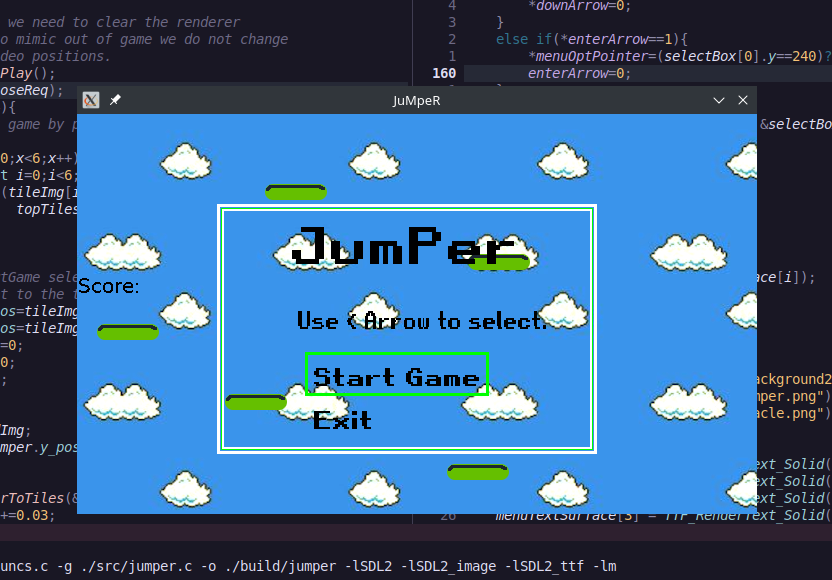

# JumPer

>## Jump and reach to the top.



Jumper is a game based on a simple jump game that used to ship with old cell phones. 

>### Tasks ToDo
* [ ] Better jump.
* [ ] Make Game smooth and fun to play
* [ ] Manage README.md

>### To contribute to the program, see the CONTRIBUTING.md file.

>### Executing the game
1. Fork & clone the repository
2. If you don't have SDL-2 Library Installed then make sure to do so by
   1.    `$ sudo apt-get install libsdl2-2.0`
   2.    `$ sudo apt-get install libsdl2-dev`
   3.    Also,  `$ sudo apt install libsdl2-image-dev`
3. Then, make build folder in the directory
        ```
        mkdir build
        ```

4. After that in terminal execute `make`

**Feel free to contribute in the repo by looking at Tasks ToDo and [Contribution.md](CONTRIBUTING.md)**
